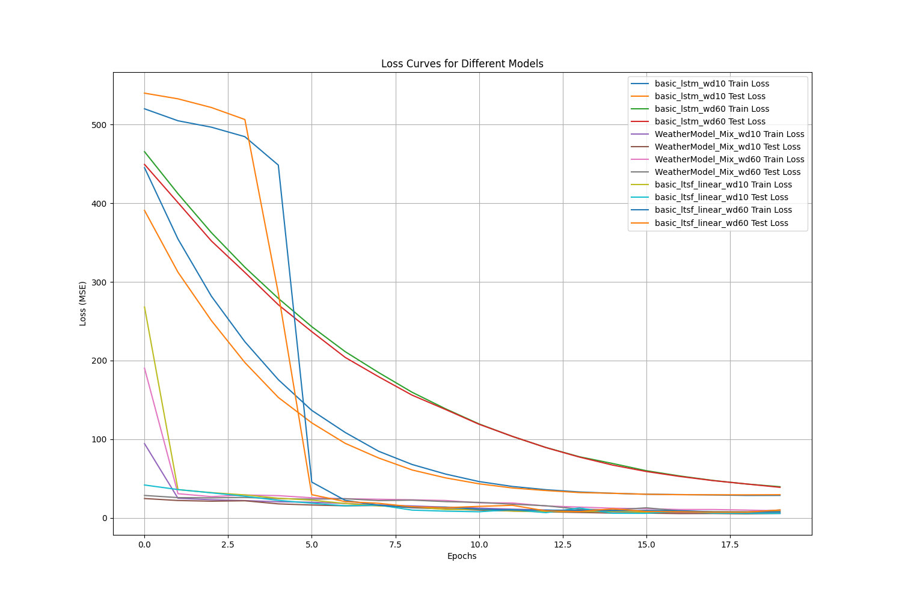
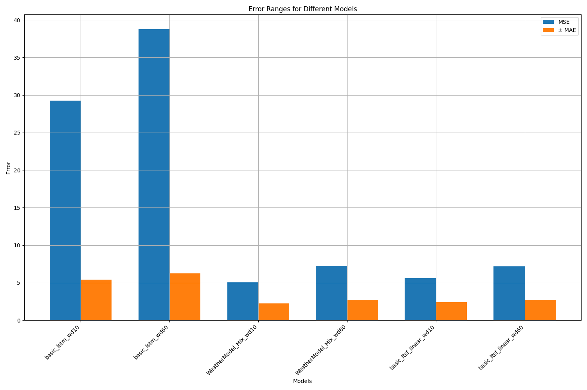

# 都是 weather 你

使用 LTSF linear 與 LSTM linear 的混合模型，進行天氣日均氣溫預測，以台灣新屋氣象站為例。

## 介紹

在傳統的時間序列預測問題中，研究人員通常會使用各種模型進行預測，如自回歸整合移動平均 (ARIMA)、季節性自回歸整合移動平均 (SARIMA) 以及長短期記憶 (LSTM) 等。然而，這些模型各有其局限性。ARIMA 和 SARIMA 模型主要適用於線性時間序列數據的預測，對於數據中的非線性模式無法有效捕捉。相反地，LSTM 模型擅長處理非線性問題，但在處理純線性數據時可能並不理想。

為了克服單一模型的局限性，我們提出了一種混合模型，結合了長期和短期記憶 (LTSF) 線性模型與 LSTM 線性模型的優點，旨在更精確地預測時間序列數據。在這項研究中，我們以台灣新屋氣象站的日均氣溫為例，進行模型訓練與預測。我們的目標是通過這種混合方法，提高日均氣溫預測的準確度，並展示混合模型在處理線性與非線性問題時的強大能力。

這項研究不僅有助於改進天氣預測的精度，還為其他類似的時間序列預測問題提供了一個有效的解決方案。通過混合模型，我們能更全面地分析數據中的多種模式，從而獲得更可靠的預測結果。

## 方法

在這項研究中，我們提出了一種混合模型，用於預測台灣新屋氣象站的日均氣溫。我們的方法結合了長期和短期記憶 (LTSF) 線性模型與長短期記憶 (LSTM) 模型的優點，旨在提高預測準確度。具體方法步驟如下：

1. **數據準備**：
   - 收集台灣新屋氣象站的歷史日均氣溫數據，進行數據清洗和預處理。
   - 將數據集分為訓練集和測試集，確保模型訓練和評估的數據不重疊。

2. **模型構建**：
   - 分別訓練 LSTM 和 LTSF 線性模型，使用相同的訓練數據進行學習。
   - LSTM 模型用於捕捉數據中的非線性模式，LTSF 線性模型則用於捕捉數據中的線性趨勢。

3. **預測結果生成**：
   - 使用訓練好的 LSTM 模型和 LTSF 線性模型分別對測試數據進行預測，獲得兩組預測結果：$ \hat{y}_{LSTM} $ 和 $ \hat{y}_{LTSF} $。

4. **誤差計算**：
   - 計算 LSTM 和 LTSF 預測結果之間的絕對差異：$ E = |\hat{y}_{LSTM} - \hat{y}_{LTSF}| $。

5. **特徵整合**：
   - 將 LSTM 預測結果、LTSF 預測結果以及它們的絕對差異 $ E $ 進行拼接 (cat)：
     $$
     X_{final} = [\hat{y}_{LSTM}, \hat{y}_{LTSF}, E]
     $$

6. **最終預測**：
   - 將拼接後的特徵 $ X_{final} $ 作為輸入，通過一個簡單的線性模型 (linear) 進行最終預測，得到最終的日均氣溫預測結果 $ \hat{y}_{final} $。

7. **模型評估**：
   - 使用常見的評估指標 (如均方誤差、平均絕對誤差等) 對最終預測結果進行評估，與單一模型的預測結果進行比較，驗證混合模型的有效性。

通過以上方法，我們希望能夠充分利用 LSTM 與 LTSF 模型各自的優勢，提升日均氣溫預測的準確性，並展示混合模型在處理線性與非線性時間序列數據方面的潛力。

## 實驗結果

在本研究中，我們比較了單獨使用 LSTM 模型、LTSF 線性模型以及我們提出的混合模型在不同窗口大小 (10 天和 60 天) 下的預測性能。預測結果使用均方誤差 (MSE) 和平均絕對誤差 (MAE) 作為評估指標。具體結果如下：

1. **基本 LSTM 模型**：
   - 窗口大小 10 天：
     - MSE: 29.2267
     - MAE: 5.4062
   - 窗口大小 60 天：
     - MSE: 38.7717
     - MAE: 6.2267

2. **基本 LTSF 線性模型**：
   - 窗口大小 10 天：
     - MSE: 5.6222
     - MAE: 2.3711
   - 窗口大小 60 天：
     - MSE: 7.1576
     - MAE: 2.6754

3. **混合模型 (WeatherModel_Mix)**：
   - 窗口大小 10 天：
     - MSE: 5.0510
     - MAE: 2.2475
   - 窗口大小 60 天：
     - MSE: 7.2316
     - MAE: 2.6892

## 討論

從結果可以看出，我們提出的混合模型在不同窗口大小下均表現出色，顯著優於單獨的 LSTM 和 LTSF 線性模型。具體來說：

- **窗口大小 10 天**：
  - 混合模型的 MSE 和 MAE 分別為 5.0510 和 2.2475，均低於基本 LSTM 模型 (MSE: 29.2267, MAE: 5.4062) 及基本 LTSF 線性模型 (MSE: 5.6222, MAE: 2.3711)。這表明混合模型能夠更好地捕捉數據中的線性與非線性模式，提升預測準確性。

- **窗口大小 60 天**：
  - 雖然混合模型的 MSE 和 MAE (分別為 7.2316 和 2.6892) 與基本 LSTM 模型 (MSE: 38.7717, MAE: 6.2267) 相比，表現明顯更好，但與基本 LTSF 線性模型 (MSE: 7.1576, MAE: 2.6754) 相比，差異不大。這可能是由於在較長的窗口大小下，數據的線性趨勢變得更加顯著，從而減少了非線性成分的重要性。

綜上所述，我們提出的混合模型在短期和中期預測中均表現出色，特別是在短期預測中，其優勢更加明顯。這證明了混合模型在處理線性與非線性時間序列數據方面的潛力，為提高預測精度提供了一種有效的解決方案。未來的研究可以進一步優化混合模型的結構，並探討其在其他領域的應用。

## 結論

在本研究中，我們提出並驗證了一種結合 LSTM 和 LTSF 線性模型的混合模型，用於預測台灣新屋氣象站的日均氣溫。結果顯示，混合模型在不同窗口大小下的預測性能均優於單獨的 LSTM 和 LTSF 線性模型，特別是在短期預測中，其優勢尤為顯著。

具體來說，混合模型在 10 天窗口大小下的均方誤差 (MSE) 和平均絕對誤差 (MAE) 分別為 5.0510 和 2.2475，顯著低於基本 LSTM 和 LTSF 線性模型。即使在 60 天窗口大小下，混合模型的表現仍然優於基本 LSTM 模型，並與 LTSF 線性模型相當，顯示出在處理較長期數據時的穩定性和可靠性。

這些結果表明，混合模型成功地結合了線性和非線性模型的優點，能夠更準確地捕捉和預測時間序列數據中的複雜模式。這一方法不僅為天氣預測提供了一個有效的解決方案，也為其他時間序列預測問題提供了新的思路。

未來的研究可以進一步優化該混合模型的結構，並探索其在更多應用場景中的潛力，從而促進時間序列預測技術的發展和應用。